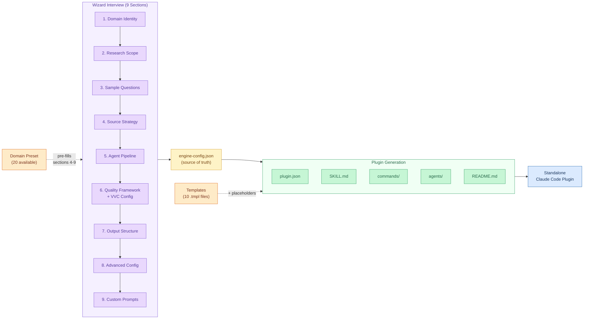
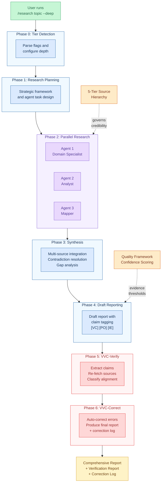

# Deep Research Engine Creator

[](https://github.com/reggiechan74/deep-research-engine-creator/releases/latest)
[](https://github.com/reggiechan74/deep-research-engine-creator/blob/main/LICENSE)
[](https://github.com/reggiechan74/deep-research-engine-creator)
[](https://github.com/reggiechan74/deep-research-engine-creator/commits/main)
[](https://github.com/reggiechan74/deep-research-engine-creator/stargazers)
[](https://github.com/reggiechan74/deep-research-engine-creator/tree/main/skills/engine-creator/domain-presets)

**Deep research tools answer questions. This builds the tools.**

Create domain-specialized deep-research engines as standalone Claude Code plugins. This meta-plugin interviews you about your research domain, then generates a complete Claude Code plugin with a custom multi-agent research pipeline, domain-specific source hierarchies, quality frameworks, and output templates. You describe what you research; it builds the tooling.

## Why I Built This

I've used deep research features across ChatGPT, Claude, and Gemini extensively. They're impressive -- and they all hit the same ceiling. They don't know which sources matter in your field. They can't tell the difference between a tier-1 regulatory filing and a blog post summarizing it. They apply the same generic quality bar to patent analysis, AML compliance, and biotech pipeline reviews as if those were the same discipline. They're not.

The phrase "all-purpose deep research engine" is, to me, an oxymoron. Real research depth requires domain knowledge -- knowing which databases to check first, what evidence thresholds apply, which citation standards your audience expects, and how to weigh conflicting sources against each other. A tool that researches everything "deeply" is really researching everything at the same shallow-expert level.

So I built this. Not a single domain engine, but a **factory that generates them**. You describe your research domain -- the sources you trust, the agents you need, the quality standards your work demands, the report structure your audience expects -- and it produces a fully self-contained research plugin tailored to that domain. A patent attorney gets patent-grade research tooling. A compliance officer gets AML-grade screening. An investigative journalist gets evidence-chain documentation. Each engine knows its own field because you taught it yours.

The general-purpose deep research tools opened the door. This walks through it.

## How It Compares

|  | Perplexity Deep Research | ChatGPT Deep Research | Gemini Deep Research | Claude Research | **Engine Creator** |
|--|:--:|:--:|:--:|:--:|:--:|
| **Domain-specific source hierarchy** | 3 domain filters max | Site-restricted search | Google Search + Drive/Gmail | Web + Google Workspace | **5-tier credibility hierarchy, unlimited domains per tier, fully customizable** |
| **Multi-agent architecture** | Single pipeline | Single pipeline | Single pipeline | Single pipeline | **Configurable multi-agent teams with per-agent specialization, model, and tools** |
| **Post-report verification (VVC)** | Citations only | Citations only | Citations only | Citations only | **Claim verification: extracts every factual claim, re-fetches the cited source, checks credibility AND accurate representation, auto-corrects errors. Citations can still hallucinate. Verified claims can't.** |
| **Quality framework** | Generic | Generic | Generic | Generic | **Configurable confidence scoring, evidence thresholds, validation rules, citation standards** |
| **Report structure** | Fixed format | Fixed (with export to MD/PDF/Word) | Fixed (with Canvas/Audio) | Fixed | **Fully customizable sections, deliverables, and naming per domain** |
| **Reproducibility** | Ephemeral | Ephemeral | Ephemeral | Ephemeral | **Versionable `engine-config.json` -- same config = same pipeline** |
| **Transparency** | Closed source | Closed source | Closed source | Closed source | **Fully open source -- every prompt, rule, and template is readable and editable** |
| **Domain presets** | -- | -- | -- | -- | **21 presets (Legal, OSINT, CRE, AML, AI/Agentic, etc.) + custom from scratch** |
| **Ownership** | SaaS | SaaS | SaaS | SaaS | **Self-contained plugins you own, version-control, and share** |
| **Setup required** | None | None | None | None | Claude Code + plugin install + wizard |
| **Built-in search index** | Proprietary crawler | Bing | Google | Web search | Relies on Claude Code tools |
| **Free tier** | 3/day | Limited | Limited | Limited | Requires Claude Code subscription |

**The tradeoff is intentional.** The SaaS tools optimize for zero-setup convenience. This plugin optimizes for domain depth, verification rigor, and professional control. If you need a quick answer to a general question, use Perplexity. If you need research where every factual claim is checked for source credibility and accurate representation -- not just decorated with a URL -- build an engine.

> **Why verification matters more than citations:** Every deep research tool cites sources. But a citation is just a URL -- it doesn't mean the AI read it correctly. The model may hallucinate a claim and attach a plausible-looking source after the fact. VVC goes further: it extracts every factual claim from the draft report, re-fetches the cited source, and answers two questions: (1) Is this source credible for this claim? (2) Was the source accurately represented? Claims that fail are auto-corrected or flagged. Citations create confidence. Verification earns it.

## Installation

Install directly from GitHub:

```bash
claude plugin add reggiechan74/deep-research-engine-creator
```

Or clone and install manually:

```bash
git clone https://github.com/reggiechan74/deep-research-engine-creator.git
claude --plugin-dir ./deep-research-engine-creator
```

## Quick Start

```bash
# 1. Run the wizard (with an optional preset)
/create-engine --preset market

# 2. Answer the wizard questions — domain, sources, agents, quality, output
#    The wizard walks you through 9 sections with smart defaults.

# 3. Validate the generated engine
/test-engine ./generated-engines/your-engine/

# 4. Install and use the generated engine
claude plugin add ./generated-engines/your-engine/
/research "your topic"
```

## Commands

| Command | Description |
|---------|-------------|
| `/create-engine [--preset name]` | Main wizard -- interviews you and generates a complete engine plugin |
| `/update-engine <path>` | Re-configure specific sections of an existing engine |
| `/test-engine <path> [topic]` | Validate structure and run smoke test on a generated engine |
| `/preview-engine <path>` | Preview what an engine config would generate (read-only) |
| `/list-engines [dir]` | Scan a directory for generated engines and display a summary table |

## Domain Presets

Presets pre-fill the wizard with domain-specific defaults for source hierarchies, agent configurations, quality rules, and output structure. You can accept them as-is or customize any section.

| Preset Flag | Domain | Key Features |
|-------------|--------|--------------|
| `--preset academic` | Academic Research | Peer-reviewed sources, systematic review methodology |
| `--preset ai` | AI & Agentic Engineering | LLM benchmarks, agent frameworks, MCP/tool use, model landscape, RAG |
| `--preset aml` | AML & Regulatory Compliance | FATF, FinCEN, sanctions screening, PEP, beneficial ownership |
| `--preset biotech` | Biotechnology & Life Sciences | Drug pipelines, GenBank, clinical stages, PTRS assessment |
| `--preset cre` | Real Estate & CRE | Property valuations, cap rates, zoning, municipal records |
| `--preset cyber` | Cybersecurity & Threat Intel | CVE/NVD, MITRE ATT&CK, IOC tracking, attack surface mapping |
| `--preset defense` | Aerospace & Defense | DSCA, SAM.gov procurement, TRL, ITAR/EAR compliance |
| `--preset energy` | Energy & Utilities | EIA, FERC, IESO, ISO/RTO markets, LCOE, rate cases |
| `--preset esg` | ESG & Climate Risk | CDP, TCFD/ISSB, carbon accounting, governance scoring |
| `--preset findd` | Financial Due Diligence | SEC filings, beneficial ownership, litigation, M&A analysis |
| `--preset geopolit` | Geopolitical & Political Risk | Country risk, sanctions, conflict monitoring, scenario planning |
| `--preset infra` | Infrastructure & Development | EA registries, municipal planning, corridor analysis, P3 |
| `--preset insurance` | Insurance & Actuarial | NAIC filings, AM Best, catastrophe models, loss ratios |
| `--preset investigate` | Investigative Journalism | Public records, corporate registries, FOI, evidence chains |
| `--preset legal` | Legal Research | Bluebook citations, case law databases, statutory analysis |
| `--preset market` | Market Intelligence | SEC filings, competitive analysis, market sizing |
| `--preset medical` | Healthcare & Medical | PubMed, clinical trials, FDA/EMA, GRADE evidence grading |
| `--preset osint` | OSINT Investigation | Multi-source correlation, digital footprint analysis |
| `--preset policy` | Government & Public Policy | Legislative tracking, lobbying disclosure, policy impact |
| `--preset supply` | Supply Chain & Logistics | WTO/Comtrade, tariff analysis, supplier risk, freight data |
| `--preset techdd` | Technical Due Diligence | Patent databases, standards compliance, IP landscape |

Or choose **Custom** during the wizard to build a configuration from scratch.

## What Gets Generated

A generated engine is a fully self-contained Claude Code plugin:

```
your-engine-name/
├── .claude-plugin/plugin.json     # Plugin manifest
├── engine-config.json             # Full configuration (editable, re-processable)
├── commands/
│   ├── research.md                # /research <topic> [--quick|--deep|--comprehensive]
│   └── sources.md                 # /sources — view configured source hierarchy
├── agents/
│   ├── agent-1.md                 # Domain-specialized research agent
│   ├── agent-2.md                 # Domain-specialized analysis agent
│   └── agent-3.md                 # Domain-specialized mapping agent
├── skills/
│   └── your-domain/
│       └── SKILL.md               # Complete research engine (~500-700 lines)
└── README.md                      # Auto-generated documentation
```

Every generated engine includes:

- A tiered research command (`/research`) with quick, standard, deep, and comprehensive modes
- A sources command (`/sources`) for inspecting the configured credibility hierarchy
- Domain-specialized agents with their own search strategies and citation prefixes
- A quality framework with confidence scoring, evidence thresholds, and validation rules
- **Claim verification (VVC)** -- not just citations. Every factual claim is extracted, the cited source is re-fetched, and both source credibility and accurate representation are verified. Citations can still hallucinate. Verified claims can't.
- Structured report output with configurable sections

## Two Output Modes

| Mode | Description | When to Use |
|------|-------------|-------------|
| **Self-contained** | Full 5-phase research pipeline embedded. No dependencies. | Sharing, portability, standalone use |
| **Extension** | Overlays customizations on the base `/deep-research` skill. Lighter weight. | When you already have `/deep-research` installed |

Self-contained engines include the complete research orchestration logic (planning, research, synthesis, reporting) in their SKILL.md. Extension engines inherit the base pipeline and only override domain-specific configuration (sources, agents, quality rules, output structure).

## The Wizard Interview

The wizard walks you through a structured interview to build your engine configuration. **Everything is customizable** -- presets are starting points, not constraints. You can accept defaults, modify individual fields, or build entirely from scratch.

### How presets work

Presets pre-fill sections 4-9 with domain-expert configurations. At every step, the wizard asks: *"Accept, Add, Remove, Modify, or Customize?"* -- you always have full control. Choosing a preset saves time; it doesn't limit what you can build.

You can also skip presets entirely and choose **Custom** to configure every field from a blank slate.

### The 9 sections

**Section 1: Domain Identity** -- Name your engine, describe the research domain, identify the target audience, choose self-contained or extension mode, and optionally select a preset.

**Section 2: Research Scope** -- Define the types of questions your engine handles (e.g., "landscape analysis", "competitive assessment"), geographic scope, temporal focus, and primary deliverable format.

**Section 3: Sample Questions** -- Provide 3-5 example research queries. The wizard uses these to auto-suggest source types, agent specializations, and report sections in later steps.

**Section 4: Source Strategy** -- Configure the 5-tier credibility hierarchy that governs how your engine evaluates sources:
- Review and customize each tier's name and source list (add, remove, reorder)
- Define preferred sites to prioritize in searches
- Define excluded sites to always skip
- Configure search templates with domain-specific query patterns (e.g., `"{patent_number}" patent claims site:{preferred_site}`)
- Set language and geographic filters

**Section 5: Agent Pipeline** -- Design the multi-agent research team. Two modes:
- **Basic:** Review the recommended 3-agent structure (researcher, analyst, synthesizer). Accept as-is, **add more agents**, remove agents, or modify any agent's configuration.
- **Advanced:** Configure each agent individually -- ID, display name, role description, sub-agent type (`general-purpose`, `expert-instructor`, or `intelligence-analyst`), model (`sonnet`, `opus`, or `haiku`), detailed specialization instructions, and tool access.
- Assign agents to research tiers (quick/standard/deep/comprehensive) and configure follow-up rounds.

There is **no limit on the number of agents** -- add as many specialized roles as your domain requires.

**Section 6: Quality Framework** -- Define evidence standards:
- Customize confidence level definitions (HIGH/MEDIUM/LOW/SPECULATIVE) for your domain
- Set minimum evidence thresholds (e.g., "all valuations require 3+ comparable transactions")
- Add, remove, or modify validation rules (e.g., "cross-check against official records")
- Choose citation standard (APA 7th, Bluebook, Chicago, or custom)
- Configure source verification mode (spot-check, comprehensive, or none)
- Set dead link handling, freshness thresholds, and verification reporting

**Section 7: Output Structure** -- Design report format:
- Define, reorder, add, or remove report sections
- Set file naming templates with variables (`{date}`, `{topic_slug}`)
- Specify special deliverables (competitive matrices, risk heatmaps, timelines, etc.)

**Section 8: Advanced Configuration** -- Optional power-user settings:
- Max research iterations per question (1-5)
- Exploration depth for recursive web traversal (1-10)
- Token budgets per phase (planning, research, synthesis, reporting)
- Custom hooks and MCP server integrations

**Section 9: Custom Prompts** -- Write the instructions your agents follow:
- **Global preamble** -- sets the overall research standard and audience expectations
- **Per-agent overrides** -- specific instructions for each agent (e.g., "always apply Porter's Five Forces")
- **Synthesis instructions** -- how findings should be combined across agents
- **Reporting tone** -- voice and style for the final report

### Preview before generation

After all 9 sections, the wizard shows a complete preview of the engine configuration. Nothing is generated until you explicitly confirm. You can go back and modify any section before proceeding.

## Example: Patent Intelligence Engine

A complete reference implementation is included:

```
See examples/patent-intelligence-engine/ for a working patent research engine.
```

This engine demonstrates the full capabilities of a generated plugin:

- **3 specialized agents:**
  - `patent-search-specialist` -- searches USPTO, EPO, WIPO, and other patent offices
  - `prior-art-analyst` -- applies TSM/KSR frameworks for novelty and obviousness analysis
  - `ip-landscape-mapper` -- builds competitive portfolio matrices and identifies whitespace
- **5-tier source hierarchy** from official patent databases (Tier 1) down to unverified claims (Tier 5)
- **Patent-specific quality rules** including patent number verification, assignee currency checks, and claim-element FTO requirements
- **12-section report structure** covering landscape overview, claims analysis, FTO assessment, IP risk matrix, and more

## Architecture

The system has two halves: the **Engine Creator** (a factory that builds engines) and the **Generated Engine** (a standalone plugin that runs research). The config file is the pivot point between them.

### Engine Creator Factory



### Generated Engine Research Pipeline

When a user runs `/research [topic]` on a generated engine, this pipeline executes:



The config file is the source of truth. You can:
- Edit it directly and re-run generation
- Use `/update-engine` to re-interview specific sections
- Use `/preview-engine` to inspect what a config would produce without writing files
- Version-control it alongside your generated engine

## Publishing

Push a generated engine to a marketplace repository:

```bash
./scripts/publish-engine.sh ./generated-engines/your-engine/ https://github.com/user/marketplace-repo
```

The script validates the engine structure, reads the name and version from `engine-config.json`, clones the marketplace repo, copies the engine, commits, and pushes.

## Requirements

- **Claude Code** with plugin support
- **For extension mode only:** the base `/deep-research` skill must be installed as a separate plugin

## File Reference

```
deep-research-engine-creator/
├── .claude-plugin/plugin.json                          # This plugin's manifest
├── commands/
│   ├── create-engine.md                                # /create-engine wizard
│   ├── update-engine.md                                # /update-engine reconfiguration
│   ├── test-engine.md                                  # /test-engine validation suite
│   ├── preview-engine.md                               # /preview-engine read-only preview
│   └── list-engines.md                                 # /list-engines directory scanner
├── skills/engine-creator/
│   ├── SKILL.md                                        # Core wizard + generation logic
│   ├── domain-presets/                                    # 21 domain presets
│   │   ├── academic-research.json
│   │   ├── aerospace-defense.json
│   │   ├── ai-agentic-engineering.json
│   │   ├── aml-compliance.json
│   │   ├── biotechnology.json
│   │   ├── cybersecurity-threat-intel.json
│   │   ├── energy-utilities.json
│   │   ├── esg-climate.json
│   │   ├── financial-due-diligence.json
│   │   ├── geopolitical-risk.json
│   │   ├── government-policy.json
│   │   ├── healthcare-medical.json
│   │   ├── infrastructure-development.json
│   │   ├── insurance-actuarial.json
│   │   ├── investigative-journalism.json
│   │   ├── legal-research.json
│   │   ├── market-intelligence.json
│   │   ├── osint-investigation.json
│   │   ├── real-estate-cre.json
│   │   ├── supply-chain-logistics.json
│   │   └── technical-due-diligence.json
│   └── templates/
│       ├── base-research-skill.md.tmpl                 # Self-contained SKILL.md template
│       ├── extension-skill.md.tmpl                     # Extension SKILL.md template
│       ├── command-template.md.tmpl                    # /research command template
│       ├── sources-command-template.md.tmpl            # /sources command template
│       ├── agent-template.md.tmpl                      # Per-agent definition template
│       ├── plugin-json.tmpl                            # plugin.json template
│       ├── readme-template.md.tmpl                     # Generated README template
│       ├── engine-config-schema.json                   # Config validation schema
│       ├── preset-schema.json                          # Domain preset validation schema
│       └── plugin-manifest-schema.json                 # Plugin manifest validation schema
├── scripts/
│   └── publish-engine.sh                               # Marketplace publishing script
├── examples/
│   └── patent-intelligence-engine/                     # Complete reference implementation
└── README.md                                           # This file
```

## License

MIT
